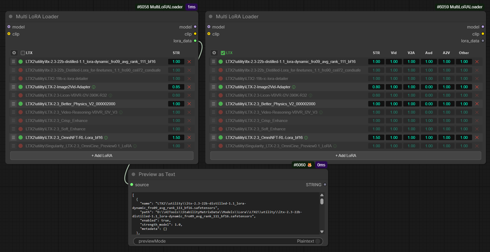

# Multi LoRA Loader

A powerful multi-LoRA management node for ComfyUI with optional LTX2 layer-specific strength control, drag-and-drop reordering, and rgthree LoRA info integration.

> **Renamed from Power LTX LoRA Loader Extra.** If you have existing workflows using the old node, see [Migration](#migration) below.



## Features

- **Multi-LoRA Support**: Load and apply multiple LoRAs simultaneously with individual strength controls
- **Two Modes**:
  - **Standard mode**: Single strength value per LoRA, applied uniformly via ComfyUI's built-in loader
  - **LTX mode**: Per-layer strength control for LTX2 video/audio models (enable via the LTX checkbox)
- **LTX Layer Controls** (when LTX mode is enabled):
  - **STR** (Strength Model): Overall model strength
  - **Vid** (Video): Video attention layers
  - **V2A** (Video-to-Audio): Cross-modal attention (video to audio)
  - **Aud** (Audio): Audio-specific layers
  - **A2V** (Audio-to-Video): Cross-modal attention (audio to video)
  - **Other**: Remaining network components
- **Intuitive UI**: Drag-and-drop row reordering, toggle enable/disable, click-to-edit or drag-to-slide values
- **Missing LoRA Detection**: LoRAs that no longer exist on disk are shown with red strikethrough text on session load, so you can spot moved or deleted files at a glance
- **rgthree LoRA Info Integration**: Right-click any LoRA name to open the rgthree LoRA info dialog (requires [rgthree-comfy](https://github.com/rgthree/rgthree-comfy)). LoRAs with fetched info display a circled info badge next to their name (green for Civitai data, gray for local info). Fetching new info from Civitai in the dialog updates the badge immediately on close
- **Optional Model/CLIP Input**: Use as a standalone LoRA manager even without model or CLIP connected
- **JSON Output**: Export a rich JSON structure of all selected LoRAs for external processing
- **Raw Config Editor**: Click the cog button to copy/paste the entire LoRA configuration as JSON
- **Sidecar Metadata Support**: Automatically loads metadata from `.json` sidecar files alongside LoRA weights

## Installation

1. Clone or download this repository into your ComfyUI `custom_nodes` directory:
   ```bash
   cd ComfyUI/custom_nodes
   git clone https://github.com/phazei/ComfyUI-MultiLoraLoader.git
   ```

2. Restart ComfyUI or reload the browser page.

3. The node will appear in the node menu under **Loaders > Multi LoRA Loader**. You can also search for "power lora loader", "lora stack", or "multi lora".

## Usage

### Basic Workflow

1. Add a **Multi LoRA Loader** node
2. Connect model and/or CLIP inputs (both optional)
3. Click **+ Add LoRA** to add rows
4. Click the LoRA name field to open a menu of available LoRAs
5. Adjust strength values by:
   - **Dragging** left/right for fine control
   - **Single clicking** to type an exact value
6. Toggle the dot on/off to enable/disable individual LoRAs
7. Drag rows by the grip handle to reorder
8. Click the X to delete a row
9. Enable the **LTX** checkbox to show per-layer strength columns

### UI Elements

| Element | Action | Purpose |
|---------|--------|---------|
| **LTX** (Checkbox) | Click | Toggle LTX per-layer mode on/off |
| **Cog** | Click | Open raw JSON editor for copy/paste/sharing |
| **Grip** | Drag vertically | Reorder LoRA rows |
| **Dot** (Toggle) | Click | Enable/disable the LoRA |
| **LoRA Name** | Left-click | Open LoRA selection menu |
| **LoRA Name** | Right-click | Show LoRA Info (requires rgthree-comfy) |
| **Info badge** | — | Indicates fetched LoRA info (green = Civitai, gray = local) |
| **~~Strikethrough~~** | — | LoRA file not found on disk (hover for tooltip) |
| **STR / Vid / V2A / Aud / A2V / Other** | Drag or click | Adjust strengths |
| **X** (Trash) | Click | Delete the row |
| **+ Add LoRA** | Click | Add a new empty row |

### Outputs

- **model**: The input model with all active LoRAs applied
- **clip**: The input CLIP with LoRAs applied (standard mode only; LTX mode passes CLIP through unchanged)
- **lora_data**: JSON string containing metadata for all selected LoRAs (enabled and disabled)

### rgthree Integration

This node integrates with [rgthree-comfy](https://github.com/rgthree/rgthree-comfy) for LoRA metadata viewing:

- **Right-click** any LoRA name and select **Show LoRA Info** to open rgthree's info dialog with Civitai data, trained words, sample images, and editable notes
- LoRAs that have fetched info display a small circled info badge next to their name:
  - **Green** badge: Civitai data has been fetched
  - **Gray** badge: Local info file exists
  - **No badge**: No info available yet (use the dialog to fetch it)

Info is cached after first fetch, so toggling, reordering, or adding LoRAs won't cause badge flicker. Closing the info dialog after fetching new data from Civitai automatically refreshes the badge.

If rgthree-comfy is not installed, the info features are simply not shown.

### Example Output

The `lora_data` output includes all LoRAs with selected weights:

```json
[
  {
    "name": "my_lora.safetensors",
    "path": "/path/to/my_lora.safetensors",
    "enabled": true,
    "strength_model": 1.0,
    "video": 0.8,
    "video_to_audio": 1.0,
    "audio": 0.5,
    "audio_to_video": 1.0,
    "other": 1.0,
    "metadata": {...}
  }
]
```

## Sharing and Batch Editing

### Using the Config Editor (cog button)

The easiest way to share or batch-edit your LoRA configuration:

1. Click the cog button in the header of the node
2. Copy the compact JSON from the dialog
3. Edit it in your text editor
4. Paste the edited JSON back and press Enter
5. Invalid JSON is ignored and the config stays unchanged

**Example config:**
```json
[{"on":true,"lora":"style_lora.safetensors","str":1.0,"vid":0.8,"v2a":1.0,"aud":0.5,"a2v":1.0,"other":1.0},{"on":false,"lora":"face_detail.safetensors","str":0.7,"vid":1.0,"v2a":1.0,"aud":1.0,"a2v":1.0,"other":1.0}]
```

### Workflow JSON Editing

You can also hand-edit workflows in the saved JSON file:

1. Open the workflow JSON file
2. Locate your node's `properties.lora_data` field
3. Edit the LoRA list directly
4. Save and reload in ComfyUI

## Migration

This node was previously called **Power LTX LoRA Loader Extra**. If you load an old workflow:

1. The old node will appear with a "Node Renamed" notice and your LoRA data visible in a text box
2. Copy the JSON data from the text box
3. Add a new **Multi LoRA Loader** node
4. Click the cog button on the new node and paste the data in
5. Enable the **LTX** checkbox if your workflow used LTX layer-specific strengths
6. Delete the old deprecated node

## Troubleshooting

### LoRA name shows red strikethrough
- The LoRA file was not found in your `models/loras` directory
- It may have been moved, renamed, or deleted
- Hover over the name for a "LoRA file not found" tooltip
- The LoRA will be skipped during execution but its configuration is preserved

### LoRA doesn't appear in the menu
- Ensure the LoRA file is in your ComfyUI `models/loras` directory
- Refresh the page or restart ComfyUI

### Disabled LoRAs don't affect the model
- Disabled LoRAs (toggle off) are kept in your configuration but not applied
- Your full configuration including disabled LoRAs is preserved in the workflow

### Can't shrink the node after expanding it
- Drag the node's resize handle to make it narrower
- The node enforces a minimum width of 500px

### LoRA Info / right-click menu not working
- Requires [rgthree-comfy](https://github.com/rgthree/rgthree-comfy) to be installed
- If rgthree is not available, the info features are silently disabled

## License

Apache 2.0. See LICENSE file.

## Credits

Built on the **Power Lora Loader** concept by [rgthree](https://github.com/rgthree/rgthree-comfy), extended with multi-LoRA management, LTX2 layer-specific strength control, and rgthree info dialog integration.

## Contributing

Contributions, bug reports, and feature requests are welcome! Please open an issue or submit a pull request at [github.com/phazei/ComfyUI-MultiLoraLoader](https://github.com/phazei/ComfyUI-MultiLoraLoader).
